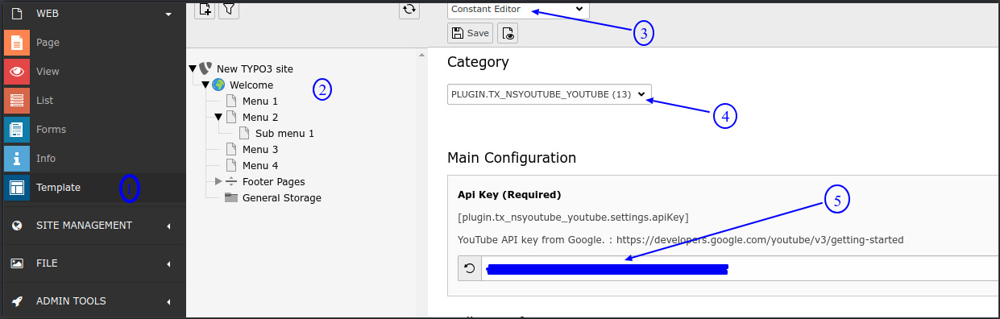
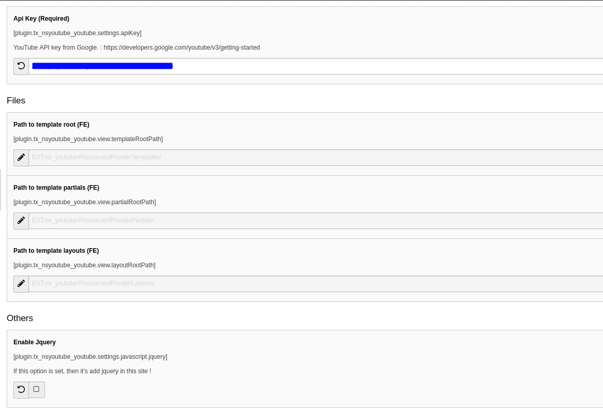
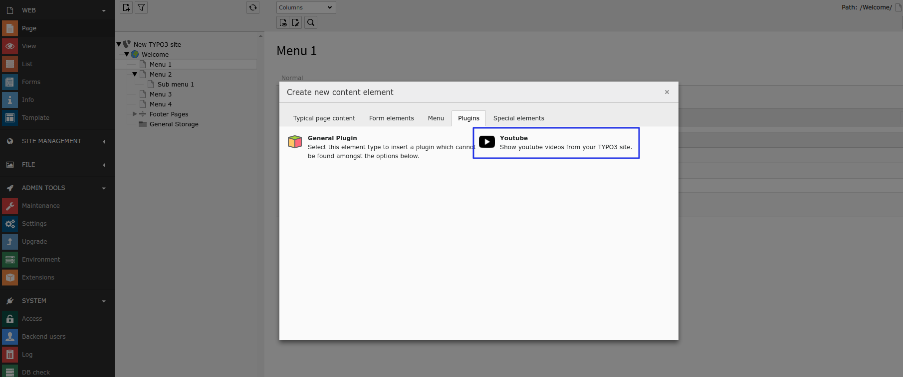
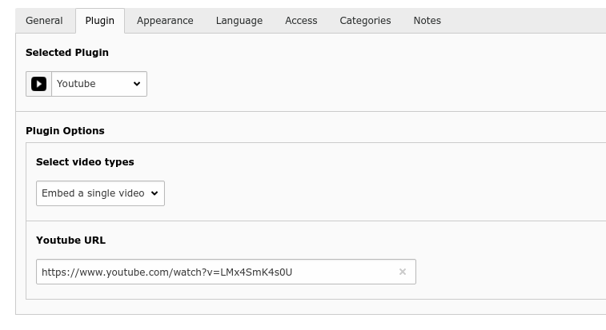
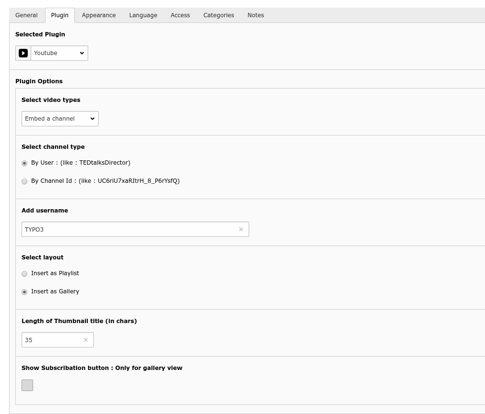

.. include:: ../Includes.txt

.. _configuration:

=============
Configuration
=============

1. Add Youtube API key
===================================

	.. rst-class:: ol-bignums

	#. Switch to the root page of your site.

	#. Switch to the **Template module** and select *Constant Editor*.

	#. Select Category = PLUGIN.TX_NSYOUTUBE (5)

	#. Generate API key from this URL: `https://developers.google.com/youtube/v3/getting-started <https://developers.google.com/youtube/v3/getting-started>`_

2. Configure Constants
========================

 	Configure extension constants as per your requirements.

3. Add Plugin To Page
======================

	Add this great plugin to the page where you want to show your youtube videos and configure this plugin as per your requirement.

.. _Clearing-the-cache:

Clearing the cache
==================

Please use the buttons 'Flush frontend caches' and 'Flush general caches'
from the top panel. The 'Clear cache' function of the install tool will also
work perfectly.