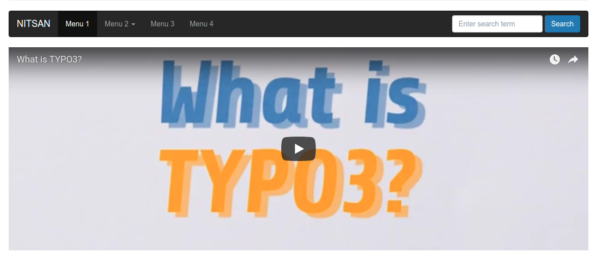
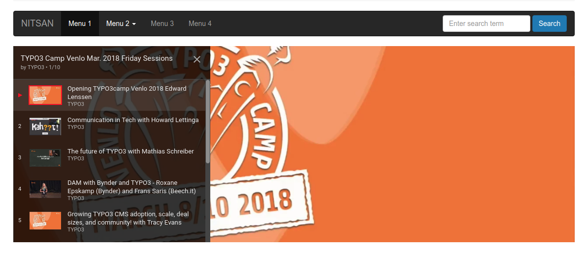
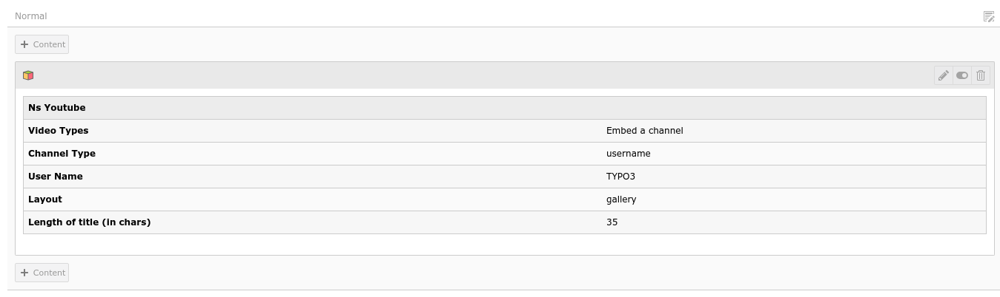


.. include:: ../Includes.txt

============
Introduction
============

[NITSAN] Plugin for YouTube.com
===============================

.. _What-does-it-do:

What does it do?
================

One of the only TYPO3 extension which provides to integrate all the features of Youtube.com as follows:

- Simple video integration
- Show Playlist
- Show Channel
- Gallery View
- Live-stream videos
- Flexibile backend configuration
- Industrial Technical Standards (Extbase/Fluid, Hooks etc.,)
- Compatible from TYPO3 6.x to 9.x

.. _Screen-shots:

Screen Shots
================

**1. Single Video View**
-------------------------

**2. Playlist View**
---------------------

**3. Gallery View**
---------------------

**4. Backend View**
--------------------

